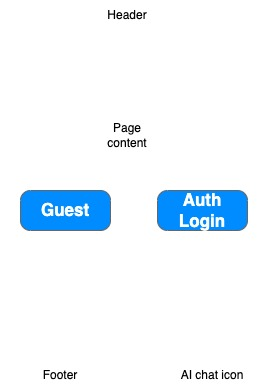

# voyage-project-learning-path-gen
Voyage Project - Learning Path Generator

## Table of Contents

* [Overview](#overview)
* [General Instructions](#general-instructions)
* [Requirements & Specifications](#requirements-and-specifications)
* [Acknowledgements](#acknowledgements)
* [About Chingu](#about-chingu)

## Overview

Hi, Chingus! 👋
 
You've probably had that moment of staring at a new career goal and wondering: *where do I even start?* Whether it's breaking into web development, leveling up to a senior engineer, or pivoting into data science, the sheer number of tutorials, courses, and roadmaps out there can be overwhelming.
 
In this Voyage, your team will design and build a **Learning Path Generator** — a web application that uses AI to turn a person's career goals into a clear, personalized, step-by-step learning journey. Instead of guessing which skills to learn next, users will get a tailored path that adapts to where they are and where they want to go.
 
This is a great project because it combines thoughtful prompt engineering, full-stack development, and UI/UX design — all skills you'll use throughout your career as a web developer. You'll work with AI APIs to generate meaningful, structured content, design an interface that makes complex information easy to navigate, and collaborate as a team to bring it all together.
 
Your goal is to create an app that's genuinely useful, easy to understand, and something you'll be proud to show off in your portfolio!
 

## General Instructions

This project is designed to be worked on by a **team** rather than an
individual Chingu. This means you and your team will need to thoroughly read
and understand the requirements and specifications below, ***and*** define and
manage your project following the *Agile Methodology* described in the
[Voyage Handbook](https://github.com/chingu-voyages/Handbook/blob/main/docs/guides/voyage/voyage.md#voyage-guide).

As you create this project, make sure it meets all of the basic requirements.
Once you've reached your **Minimum Viable Product (MVP)** state, start
implementing the optional stretch goals — or get creative and extend it in ways
we haven't even thought of yet! In other words, use the power of teamwork to
make your version distinctive and unique.

A few things to keep in mind:

* **UI/UX creativity is yours to explore** — design an interface that stands
  out while still being easy to use. There is no single "right" way for the
  game to look.
* **No paid subscriptions or software are required** for this project. All
  tools and resources you need are free.
* You may use AI for **research and learning**. However, you may ***NOT*** use
  AI to write the code for your app. The code must be written by your team.

There are many [web hosting services](https://github.com/chingu-voyages/Handbook/blob/main/docs/resources/techresources/appdeployment.md) 
with free tiers you can use to deploy your app.

## Requirements and Specifications

### What You Need to Do

The sections below describe what your team needs to build. The
**Basic Requirements** are the minimum features needed to have a working game
(your MVP). The **Stretch Goals** are extra features for teams that finish
early or want an extra challenge — they are completely optional.

> 📌 **Tier Note:** Basic Requirements are designed for **Tier 1** Voyagers
> (Beginner Frontend). Stretch Goals are designed with **Tier 2** and
> **Tier 3** Voyagers in mind, but any team is welcome to try them!

**Make sure you control the scope** so you'll be
able to complete the basic requirements by the end of the Voyage. Remember, you can always
add optional items and enhancements once you've completed the basic app.

#### Structure

* [ ] This can be implemented as a frontend application for Tier 1 & Tier 2. Tier 3 teams should implement both a frontend and backend.
* [ ] You may use any languages, tools, or libraries your team agrees on to design and build this app.
* [ ] You may use AI for research. But, you may **_NOT_** use it to create code for your app.
* [ ] Your app must be **deployed** to a hosting service so it can be accessed
  through the Internet. Free hosting options include
  [GitHub Pages](https://pages.github.com/),
  [Netlify](https://www.netlify.com/),
  [Vercel](https://vercel.com/), or
  [Render](https://render.com/).
* [ ] Your GitHub repo must contain a well-written `README.md` file that describes
  your app and includes the link to the deployed version.
* [ ] Navigation options (as applicable)

  * **Home** - displays the landing page when clicked
  * **Results** - displays results and any statistics that your team decides to track

* [ ] Screens

  * Home Screen (example of a very basic outline. Intentionally left vague because we want to see what you create)

    

    * Content that advertises the purpose of the app and it's benefits

    **_Optional_** User authentication is not required, but you may add it if you wish.

 * [ ] User Interface and Experience (UI/UX)

  * In general, you will find these [UI design principles](https://www.justinmind.com/ui-design/principles) helpful.
  * If your team doesn't include a dedicated UI/UX Designer you will [find these tips](https://github.com/chingu-voyages/Handbook/blob/main/docs/resources/techresources/uiux.md)
    helpful.

#### Styling

* [ ] Surprise us!!! Use your team's creativity to make this app distinctive.
* [ ] Colors within this description are examples from the existing game. If you choose alternative colors to fit your
team's style or consistency, don't forget to keep intuitive gameplay in mind.
* [ ] Your app should be **visually clean and easy to read**. Think about contrast,
  font size, and spacing so that all users can comfortably play the game.
* [ ] Every page (or screen) should include:
  * A **header** with the name of your app.
  * A **footer** with a link to your team's GitHub repository.
* [ ] Your app should look good on both **desktop and mobile** screen sizes
  (responsive design). At minimum, the game should be fully playable on a
  standard desktop browser.
* [ ] Refer to these
  [UI design principles](https://www.justinmind.com/ui-design/principles) for
  guidance if your team doesn't have a dedicated UI/UX Designer.
* [ ] If your team includes a UI/UX Designer, they should create wireframes for
  each screen before the team starts coding. Refer to the Chingu Handbook's
  [UI/UX tips](https://github.com/chingu-voyages/Handbook/blob/main/docs/resources/techresources/uiux.md)
  for guidance.
* [ ] Add a footer containing a link to your team's GitHub repo.
* [ ] Recommend using this resource for [clean CSS](https://israelmitolu.hashnode.dev/writing-cleaner-css-using-bem-methodology).

#### Functionality

* [ ] Application Overview

  * Teams will have to decide on how best to store data as needed. Browser's Local Storage is a good option. You could also use free tiers from Firebase or Supabase.
  You can surprise us by adding more as your team decides.

### Basic Requirements (MVP)

These are the features your app **must** include. Think of them as the rules of
the game — without them, the app isn't really Wordle!

##### Game Setup

* [ ] The app must have a built-in list of valid **five-letter English words**.
  * At the start of each game, the app randomly selects one word from this
    list as the **secret word** for the player to guess.
  * The word list must contain **at least 500 words**. You can find free,
    publicly available word lists online (for example, the list used by the
    original NYT Wordle is publicly available).
  * The word list should only include **common English words** that a typical
    9th-grade student would know (avoid extremely rare, offensive, or obscure
    words).

##### Gameplay

* [ ] The player has **6 attempts** to guess the secret word.
* [ ] Each guess must be a valid **five-letter word**. The app should not accept
  guesses that are fewer or more than 5 letters.
* [ ] After each guess is submitted, the app must give the player
  **color-coded feedback** for each letter in their guess. Examples from the existing game are:
  * 🟩 **Green** — The letter is in the secret word AND is in the correct position.
  * 🟨 **Yellow** — The letter is in the secret word BUT is in the wrong position.
  * ⬜ **Gray** — The letter is NOT in the secret word at all.  
* [ ] The feedback must be displayed on a **game board** (a grid of rows and tiles)
  that shows all previous guesses and their color-coded results.
* [ ] The game board must show all 6 rows at once, with empty tiles for guesses
  that haven't been made yet.

##### On-Screen Keyboard

* [ ] The app must display an **on-screen keyboard** (A–Z) that the player can
  click or tap to enter letters.
* [ ] As the player makes guesses, the on-screen keyboard must **update the color
  of each letter key** to reflect the best hint received for that letter so far:
  * Green if the letter has been confirmed in the correct position.
  * Yellow if the letter is in the word but in the wrong position.
  * Gray if the letter has been ruled out.
  * Uncolored/default if the letter has not been guessed yet.
* [ ] Players should also be able to type their guess using a **physical keyboard**,
  in addition to using the on-screen keyboard.

##### Winning and Losing

* [ ] If the player guesses the secret word correctly, the app must:
  * Display a **congratulations message** that tells the player they won.
  * Show the player how many guesses it took (e.g., "You got it in 4 tries!").
* [ ] If the player uses all 6 guesses without finding the word, the app must:
  * Display a **game over message** that reveals the correct secret word.
* [ ] After winning or losing, the player must be given the option to **start a
  new game** with a new random secret word.

##### Input Validation & Error Handling

* [ ] The app should only accept 5-letter words as guesses. If the player tries to
  submit a guess that is not 5 letters long, display a clear message telling
  them why the guess was not accepted.
* [ ] *(Optional for MVP, encouraged for stretch):* Validate that the guessed word
  is a real word from the word list. If the player submits a random string of
  letters that isn't a real word, inform them.
* [ ] Error messages must be clear and helpful, not just "Error." For example:
  "That word isn't in our word list. Try another word!"
* [ ] Error messages should disappear or be cleared once the player corrects their
  input.


 ## Stretch Goals
 Once you complete the basic application, you may enhance it with any of the following optional stretch goals. Make sure that any of these you choose matches the capabilities of your team.

> These features are designed with **Tier 2** and **Tier 3** skill levels in
> mind, but any team is welcome to try them. Make sure to add acceptance
> criteria to your repo's `README.md` for any stretch goals you implement.

  * [ ] Authenticate users via Google or Github to enhance your app's security.
  * [ ] Allow users to switch between light and dark mode.
  * [ ] Integrate AI into your app to provide users with hints. The 
[Gemini Flash 1.5 free tier](https://ai.google.dev/pricing#1_5flash) is sufficient for this.

##### Enhanced Gameplay

* [ ] **Hard Mode** — Once a letter is confirmed as correct (green) or present
  (yellow), the player must use that letter in all future guesses. Add a
  toggle in the settings to turn Hard Mode on or off.
* [ ] **Different Word Lengths** — Allow the player to choose to play with
  4-letter, 5-letter, or 6-letter words instead of always using 5 letters.
  The game board and keyboard should adjust accordingly.
* [ ] **Word Categories** — Let the player choose a category (e.g., Animals,
  Foods, Countries) and pull the secret word only from words in that category.
* [ ] **Daily Word Mode** — Instead of a random word every game, use a set
  schedule so all players get the same word on the same day (just like the
  original Wordle). This requires a deterministic word-selection method based
  on the current date.
* [ ] **Guess Validation Against a Word List** — Reject guesses that are not in a
  dictionary word list, showing the player a message like "Not in word list."
  This makes the game more challenging and closer to the original.

##### Animations & Visual Polish

* [ ] Add **tile flip animations** when a row is revealed after a guess is
  submitted, similar to the original Wordle.
* [ ] Add a **shake animation** to the current row when an invalid guess is
  submitted.
* [ ] Add a **color theme** option, allowing the player to switch between a
  **Light Mode** and a **Dark Mode** for the game interface. Save the player's
  preference using `localStorage` so it persists between sessions.
* [ ] Add a **High Contrast Mode** that uses different colors (e.g., orange and
  blue instead of yellow and green) to improve accessibility for color-blind
  players.

##### Statistics & Sharing

* [ ] **Game Statistics Panel** — Track and display the player's stats across
  multiple games, including:
  * Total games played
  * Win percentage
  * Current win streak
  * Best (longest) win streak
  * Guess distribution (a bar chart showing how many games were won in 1
    guess, 2 guesses, 3 guesses, etc.)
  * Store the statistics in the browser using `localStorage` so they
    persist between sessions.
* [ ] **Share Results** — After the game ends (win or lose), give the player a
  **"Share"** button that copies a spoiler-free emoji grid of their results to
  the clipboard. For example:
  ```
  Wordle 5/6
  ⬜🟨⬜⬜⬜
  ⬜⬜🟨⬜🟩
  🟨⬜⬜🟨🟩
  🟩🟩⬜🟩🟩
  🟩🟩🟩🟩🟩

##### Accessibility

* [ ] Make the app fully **keyboard accessible** — every action (typing a letter,
  submitting a guess, starting a new game, opening settings) should be
  achievable without a mouse.
* [ ] Add **screen reader support** by using proper ARIA labels and roles on the
  game board tiles and keyboard keys, so that players who use assistive
  technology can understand the game state.

##### Responsive Design

* [ ] Ensure the full game is **fully playable on mobile devices** (small
  touchscreens), not just desktop browsers. The layout should adapt cleanly
  to narrow viewports.

##### Backend / Full-Stack (Tier 3)

* [ ] Build a **backend server** (e.g., using Node.js/Express) to:
  * Serve the word list from a database instead of a hardcoded frontend array.
  * Store and retrieve **player statistics** server-side, so they persist
    across devices and browsers.
* [ ] Implement **user authentication** (e.g., via GitHub OAuth or Google Sign-In)
  so players can log in and access their personal stats from any device.


## Acceptance Criteria

Your finished project should meet all of the following minimum standards:

* [ ] Your GitHub repo contains a well-written `README.md` that includes a link
  to your deployed app, a description of the project, and the names/GitHub
  profiles of all team members.
* [ ] The deployed app is accessible and fully playable in a modern web browser
  without any console errors.
* [ ] The game board correctly displays color-coded feedback (green, yellow, gray)
  for each letter in every guess.
* [ ] The on-screen keyboard updates letter colors to reflect hints received.
* [ ] The game correctly identifies when the player has won or lost and displays
  the appropriate message.
* [ ] The player is always given the option to start a new game after a game ends.
* [ ] Input validation prevents invalid guesses from being submitted, and error
  messages are clear and helpful.
* [ ] The UI is responsive and usable on both desktop and mobile screen sizes.
* [ ] If your team implemented any stretch goals, add their acceptance criteria
  directly to your repo's `README.md`.


## Acknowledgements

We would like to express our profound gratitude to the global developer
community, whose collaborative spirit and shared knowledge continually
motivate and enrich our endeavors. Together, we achieve extraordinary
milestones. Thank you.

## About Chingu

If you aren't yet a member of Chingu we invite you to [join us](https://chingu.io).
We help our members transform what they've learned in courses & tutorials into the
practical experience employers need and want. The experience that helps to set you
apart from other applicants for the same jobs.
